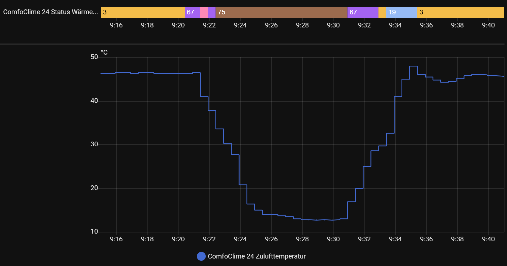

## IDs

### UUID

The API uses UUIDs to uniquely identify each device. The UUID is identical to the device's serial number (as displayed in the ComfoClime app, for example).

### Device ID

Each device connected to the ComfoNet bus also has a device ID (`DEVID`, called `modelTypeId` in the API). Some devices don't have a device ID (for example the option box). In such cases, `DEVID` is `NULL`.


## Known API Endpoints 

| API endpoint | Function | Additional information |
|--------------|----------|------------------------|
| `/monitoring/ping` | UUID of interface, uptime, timestamp | retreived on first connect |
| `/monitoring/health` | some system data about memory and rx/tx | |
| `/system/systems` | location and connection of ComfoClime | |
| `/system/time` | current time of the device | |
| `/wifi/list` | the wifi the unit is connected to | |
| `/system/$UUID$/devices` | list of all connected devices | on ComfoNet bus / CAN bus |
| `/system/$UUID$/dashboard` | data for dashboard in app | temperatures, fanspeeds, ... |
| `/system/$UUID$/alarms` | all errors of connected devices | seems to contain history |
| `/system/$UUID$/scheduler` | list of schedules | |
| `/system/$UUID$/thermalprofile` | reading/setting thermal profile | some values |
| `/device/$UUID$/property/X/Y/Z` | reading properties of device | |
| `/device/$UUID$/telemetry/N` | reading sensor values from device | |
| `/device/$UUID$/definition` | reads some basic data for the device | |
| `/device/$UUID$/method/X/Y/3` | setting properties of device | data contains additional byte Z at the beginning which seems to be the property ID |

### API Endpoints and UUIDs

The `system/$UUID$/*` APIs only work for the UUIDs of the ComfoClime devices.

The `device/$UUID$/*` APIs work for the UUIDs of the ComfoClime devices as well as for other devices connected to the ComfoNet bus, e.g., a ComfoAirQ device.

## API Endpoint Documentation

**Notes:** When using the commands in the examples below, make sure to make the following replacements:

- `$IP_ADDRESS$`: ip address or hostname of your ComfoClime unit.
- `$UUID$`: serial number of your ComfoClime unit (as displayed in the ComfoClime app).

### API Endpoint /system/$UUID$/dashboard

#### API Endpoint

```http
GET /system/$UUID$/dashboard
```

#### Curl Example

```bash
curl $IP_ADDRESS$/system/UUID/dashboard
```

#### Returned JSON

Example from a ComfoClime device with firmware version `1.5.5` and temperature selection in `auto` mode:

```json
{
   "indoorTemperature": 25.4,
   "outdoorTemperature": 27.8,
   "exhaustAirFlow": 485,
   "supplyAirFlow": 484,
   "fanSpeed": 2,
   "seasonProfile": 0,
   "temperatureProfile": 0,
   "season": 2,
   "schedule": 0,
   "status": 1,
   "heatPumpStatus": 5,
   "hpStandby": false,
   "freeCoolingEnabled": false,
   "caqFreeCoolingAvailable": true
}
```

#### Fields

| Key name in JSON          | Min. firmware | Description                                                  |
| ------------------------- | ------------- | ------------------------------------------------------------ |
| `indoorTemperature`       |               | Temperature of the extracted air from inside the house.      |
| `outdoorTemperature`      |               | Temperature of the outside air.                              |
| `exhaustAirFlow`          |               | Volume of the air blown out of the house per time unit.      |
| `supplyAirFlow`           |               | Volume of the air blown into the house per time unit.        |
| `fanSpeed`                |               | Fan speed of the ComfoAir unit. This may be overridden by the ComfoClime device. |
| `setPointTemperature`     |               | Manually selected temperature.<br />**Note:**This field is only returned if temperature selection is in manual mode. In that case, the fields `seasonProfile` and `temperatureProfile` are not returned in the JSON. |
| `seasonProfile`           |               | Current season profile (not available in the ComfoClime app).<br />**Note:**This field is only returned if temperature selection is in auto mode. In that case, the field `setPointTemperature` is not returned in the JSON. |
| `temperatureProfile`      |               | Current temperature profile (eco, comfort, power).<br />**Note:**This field is only returned if temperature selection is in auto mode. In that case, the field `setPointTemperature` is not returned in the JSON. |
| `season`                  |               | Current season (heating, cooling, transitional).             |
| `schedule`                |               | Current schedule ID.                                         |
| `status`                  |               | Unknown.                                                     |
| `heatPumpStatus`          |               | Bitfield indicating the heat pump's status (see below).      |
| `hpStandby`               |               | Device power: off or on.                                     |
| `freeCoolingEnabled`      | 1.5.0         | Current "free cooling" status (using cool outside air with the bypass at 100% instead of active cooling). |
| `caqFreeCoolingAvailable` | 1.5.5         | Active (heat pump) cooling supported by "free cooling" (using cool outside air). |

### API Endpoint /system/$UUID$/devices

#### API Endpoint

```http
GET /system/$UUID$/devices
```

#### Curl Example

```bash
curl $IP_ADDRESS$/system/UUID/devices
```

#### Returned JSON

```json
{
   "devices": [
      {
         "uuid": "SIT123123123",
         "modelTypeId": 1,
         "variant": 3,
         "zoneId": 1,
         "@modelType": "ComfoAirQ 600",
         "name": "ComfoAirQ 600",
         "displayName": "ComfoAirQ 600",
         "fanSpeed": 2
      },
      {
         "uuid": "MBE123123123",
         "modelTypeId": 20,
         "variant": 0,
         "zoneId": 1,
         "@modelType": "ComfoClime 36",
         "name": "ComfoClime 36",
         "displayName": "ComfoClime 36",
         "version": "R1.5.0",
         "temperatureProfile": 0
      },
      {
         "uuid": "ENG123123123",
         "modelTypeId": 222,
         "variant": 0,
         "zoneId": 255,
         "@modelType": "ComfoHub",
         "name": "ComfoHub",
         "displayName": "ComfoHub"
      }
   ]
}
```

The example above is from an installation with ComfoAir, ComfoClime, and ComfoConnect Pro units.

#### Fields

| Key name in JSON     | Description                                                  |
| -------------------- | ------------------------------------------------------------ |
| `uuid`               | UUID = serial number of the device.                          |
| `modelTypeId`        | DEVID, represents the model type on the ComfoNet bus.        |
| `variant`            | Unknown                                                      |
| `zoneId`             | Unkown                                                       |
| `@modelType`         | Vendor model type                                            |
| `name`               | Vendor model name                                            |
| `displayName`        | Vendor model display name                                    |
| `fanSpeed`           | Fan speed setting (peculiar to find that here as the value is already returned by the dashboard API) |
| `version`            | Firmware version                                             |
| `temperatureProfile` | Temperature profile (again, peculiar to find that here as the value is already returned by the dashboard API) |

### API Endpoint /system/$UUID$/thermalprofile

#### API Endpoint

```http
GET /system/$UUID$/thermalprofile
```

#### Curl Example

```bash
curl $IP_ADDRESS$/system/UUID/thermalprofile
```

#### Returned JSON

```json
{
   "season": {
      "status": 1,
      "season": 2,
      "heatingThresholdTemperature": 14.0,
      "coolingThresholdTemperature": 17.0
   },
   "temperature": {
      "status": 1,
      "manualTemperature": 26.0
   },
   "temperatureProfile": 0,
   "heatingThermalProfileSeasonData": {
      "comfortTemperature": 21.5,
      "kneePointTemperature": 12.5,
      "reductionDeltaTemperature": 1.5
   },
   "coolingThermalProfileSeasonData": {
      "comfortTemperature": 24.0,
      "kneePointTemperature": 18.0,
      "temperatureLimit": 26.0
   }
}
```

The example above is from an installation with ComfoAir, ComfoClime, and ComfoConnect Pro units.

#### Fields

| Key name in JSON                                             | Description                                                  |
| ------------------------------------------------------------ | ------------------------------------------------------------ |
| `status`                                                     | Unknown                                                      |
| `season.season`                                              | `0`: transitional<br />`1`: heating<br />`2`: cooling<br />  |
| `season.heatingThresholdTemperature`                         | Heating threshold temperature. Not used when season selection is set to auto. |
| `season.coolingThresholdTemperature`                         | Cooling threshold temperature. Not used when season selection is set to auto. |
| `temperature.manualTemperature`                              | Manual comfort temperature. Not used when season selection is set to auto. |
| `temperatureProfile`                                         | Current temperature profile (eco, comfort, power).           |
| `heatingThermalProfileSeasonData.<br />comfortTemperature`   | Heating comfort temperature.                                 |
| `heatingThermalProfileSeasonData.<br />kneePointTemperature` | Heating curve knee point.                                    |
| `heatingThermalProfileSeasonData.<br />reductionDeltaTemperature` | Heating reduction delta.                                     |
| `coolingThermalProfileSeasonData.<br />comfortTemperature`   | Cooling comfort temperature.                                 |
| `coolingThermalProfileSeasonData.<br />kneePointTemperature` | Cooling curve knee point.                                    |
| `coolingThermalProfileSeasonData.<br />temperatureLimit`     | Cooling maximum temperature.                                 |

### API Endpoint /system/$UUID$/alarms

#### API Endpoint

```http
GET /system/$UUID$/alarms
```

#### Curl Example

```bash
curl $IP_ADDRESS$/system/UUID/alarms
```

#### Returned JSON

```json
{
   "devices": [
      {
         "uuid": "SIT123123123",
         "modelTypeId": 1,
         "variant": 3,
         "zoneId": 1,
         "errors": [
            0,
            0,
            0,
            0,
            0,
            0,
            0,
            0,
            0,
            0,
            0,
            0,
            0,
            0,
            0,
            0,
            0,
            0,
            0,
            0,
            0,
            0,
            0,
            0,
            0,
            0,
            0,
            0,
            0,
            0,
            0,
            0
         ]
      },
      {
         "uuid": "MBE123123123",
         "modelTypeId": 20,
         "variant": 0,
         "zoneId": 1,
         "errors": [
            0,
            0,
            0,
            0,
            0,
            0,
            0,
            0,
            0,
            0,
            0,
            0,
            0,
            0,
            0,
            0,
            0,
            0,
            0,
            0,
            0,
            0,
            0,
            0,
            0,
            0,
            0,
            0,
            0,
            0,
            0,
            0
         ]
      },
      {
         "uuid": "ENG123123123",
         "modelTypeId": 222,
         "variant": 0,
         "zoneId": 255,
         "errors": [
            0,
            0,
            0,
            0,
            0,
            0,
            0,
            0,
            0,
            0,
            0,
            0,
            0,
            0,
            0,
            0,
            0,
            0,
            0,
            0,
            0,
            0,
            0,
            0,
            0,
            0,
            0,
            0,
            0,
            0,
            0,
            0
         ]
      }
   ]
}
```

The example above is from an installation with ComfoAir, ComfoClime, and ComfoConnect Pro units.

#### Fields

Apparently this contains a list of errors/alarms/notifications for each device. No additional information is available at this point.

## Reading properties

The `./property` endpoint reads values from the ComfoNet bus similiar to the RMI Protocol (as described [here](https://github.com/michaelarnauts/aiocomfoconnect/blob/master/docs/PROTOCOL-RMI.md)).

The address translates like:

```
/device/$UUID$/property/X/Y/Z
where:
X = Unit
Y = Subunit
Z = Property
```

For example, querying `/device/.../property/1/1/4` on a ComfoAir device returns the serial number of the device. You always receive data as byte array in decimal representation.

Changing a value in the app results in a PUT request to the property. 

The `./telemetry` endpoint reads sensor values from the ComfoNet bus similiar to the PDO protocol (as described [here](https://github.com/michaelarnauts/aiocomfoconnect/blob/master/docs/PROTOCOL-PDO.md)), where `N` is the number of the sensor.

## Writing properties

Using the `./method` endpoint you can write data back to the ComfoNet bus. Unit and subunit are in the URL, the last number is `3`, which represents a write request (similar to the ComfoConnect LAN C). 

**Example:** Write a value of `17°C` to the curve kneepoint heating (`22/1/4`)

```http
PUT http://{host}/device/{UUID}/method/22/1/3
```

Data:

```json
{ data: [4,170,0] }
```


## ComfoClime Nodes

### Available units
| DEC  | HEX  | subunit count | name | usage |
|------|------|---------------|------|-------|
| 1    | 0x01 | 1             | NODE | General node information |
| 2    | 0x02 | 1             | COMFOBUS | Bus unit |
| 3    | 0x03 | 1             | ERROROBJECT | ?? |
| 21   | 0x15 | 2             | ??   | ?? |
| 22   | 0x16 | 1             | TEMPCONFIG | Configuration data (season, temp values, ...) |
| 23   | 0x17 | 1             | HEATPUMP | Configuration of heatpump |
| 25   | 0x19 | 1             | ??   | ?? |
| 26   | 0x1A | 1             | ??   | ?? |

### Properties of subunits

| Unit | SubUnit | Property | Access | Format | Description |
|------|---------|----------|--------|--------|-------------|
| NODE | 1       | 1        | rw     | UINT8  | Zone = 1      |
| NODE | 1       | 2        | ro     | UINT8  | ProductID = 20 |
| NODE | 1       | 3        | ro     | UINT8  | ProductVariant = 1 |
| NODE | 1       | 4        | ro     | STRING | Serial number MBE...  |
| NODE | 1       | 5        | ro     | UINT8  | Hardware Version =1 |
| NODE | 1       | 6        | ro     | UINT8  | firmware version |
| NODE | 1       | 7        | ro     | UINT32 | CNObjsVersion?? |
| NODE | 1       | 20       | rw     | STRING | name |
| COMFOBUS | 1       | 1        |        | UINT8  | Zone = 1 |
| COMFOBUS | 1       | 2        |        | UINT8  | BusOffCount |
| COMFOBUS | 1       | 3        |        | UINT8  | CanReceiveErrorCount = 0 |
| COMFOBUS | 1       | 4        |        | UINT8  | CanTransmitErrorCount = 0 |
| ERROROBJECT | 1       | 1        |        | UINT8  | Zone = 1 |
| 21   | 1       | 1        |        | UINT8  | ?? = 1      |
| 21   | 2       | 1        |        | UINT8  | ?? = 1      |
| 22   | 1       | 1        |        | UINT8  | ?? = 1      |
| 22   | 1       | 2        |        | UINT8  | season automatic on/off |
| 22   | 1       | 3        |        | UINT8  | season select (0 = transitional, 1 = heating, 2 = cooling) |
| 22   | 1       | 4        |        | UINT16 | curve kneepoint heating |
| 22   | 1       | 5        |        | UINT16 | curve kneepoint cooling |
| 22   | 1       | 8        |        | UINT8  | automatic temperature select |
| 22   | 1       | 9        |        | UINT16 | comfort temp heating |
| 22   | 1       | 10       |        | UINT16 | comfort temp cooling |
| 22   | 1       | 11       |        | UINT16 | maximum temp while cooling |
| 22   | 1       | 12       |        | UINT16 | heating delta/difference |
| 22   | 1       | 13       |        | UINT16 | manual mode target temperature |
| 22   | 1       | 15       |        | UINT16 | minimum outdoor temp for cooling |
| 22   | 1       | 16       |        | UINT16 | maximum outdoor temp for heating |
| 22   | 1       | 17       |        | UINT16 | [91,1],[94,1] maximum TPMA |
| 22   | 1       | 18       |        | UINT8  | ?? = 70 alpha TPMA ?? |
| 22   | 1       | 19       |        | UINT16 | ?? = [232,3] |
| 22   | 1       | 20       |        | UINT16 | ?? = [50,0] |
| 22   | 1       | 21       |        | UINT8  | ?? = 0 force comfoclime off? |
| 22   | 1       | 23       |        | UINT8  | ?? = 10 |
| 22   | 1       | 24       |        | UINT16 | ?? = [3,0] |
| 22   | 1       | 25       |        | UINT8  | ?? = 0 |
| 22   | 1       | 26       |        | UINT8  | ?? = 1 cool freq enable? |
| 22   | 1       | 27       |        | UINT8  | ?? = 0 heat freq enable? |
| 22   | 1       | 28       |        | UINT8  | ?? = 0 season profile? |
| 22   | 1       | 29       |        | UINT8  | ComfoClime temp profile (0 = Comfort, 1 = Power, 2 = Eco) |
| 22   | 1       | 40       |        | UINT8  | ?? = 0 |
| 22   | 1       | 41       |        | UINT16 | ?? = [0,0] |
| 22   | 1       | 42       |        | UINT8  | ?? = 0 |
| 23   | 1       | 2        |        | UINT16 | ?? temp = 30,0°C |
| 23   | 1       | 3        |        | UINT16 | heating pump max temp |
| 23   | 1       | 4        |        | UINT16 | heating pump min temp |
| 23   | 1       | 5        |        | UINT16 | ?? temp = 20,0°C |
| 23   | 1       | 6        |        | UINT16 | ?? temp = 5,0°C |
| 23   | 1       | 7        |        | UINT16 | ?? temp = 60,0°C |
| 23   | 1       | 8        |        | UINT16 | ?? temp = 0,0°C |
| 23   | 1       | 9        |        | UINT16 | ?? temp = 0,1°C |
| 23   | 1       | 10       |        | UINT16 | ?? temp = 1,5°C |
| 23   | 1       | 11       |        | UINT8  | ?? = 0 |
| 23   | 1       | 12       |        | UINT16 | ?? = [0,0],[1,0] |
| 23   | 1       | 13       |        | UINT16 | ?? = [0,0] |
| 23   | 1       | 14       |        | UINT16 | ?? = [200,0],[214,1] |
| 23   | 1       | 15       |        | UINT8  | ?? = 100 |
| 23   | 1       | 16       |        | UINT8  | ?? = 100 |
| 23   | 1       | 17       |        | UINT16 | ?? = [25,0] |
| 23   | 1       | 18       |        | UINT16 | ?? = [45,0] |
| 23   | 1       | 19       |        | UINT16 | ?? = [2,0] |
| 23   | 1       | 32       |        | UINT32 | ?? = [0,0,0,0] |
| 25   | 1       | 1        |        | UINT8  | ?? = [2,0]      |
| 26   | 1       | 1        |        | UINT8  | ?? = 0     |


## ComfoClime Sensors

| Telemetry number | Format | Description |
|------------------|--------|-------------|
| 1-784 | | N/A |
| 785 | | = 0 ?? |
| 3500-4111 | | N/A |
| 4112 | | = 0 ?? |
| 4113 | | = 0 ?? |
| 4116 | | = 0 ?? |
| 4117 | | = 255 ?? |
| 4120 | | = 0 ?? |
| 4121 | | = 0 ?? |
| 4124 | | = [255,255,255,255] ?? |
| 4125 | | = [0,0,0,0] ?? |
| 4128 | | = [1,0] ?? |
| 4129 | | = [0,0] ?? |
| 4132 | | = [0,0] ?? |
| 4133 | | = [0,0] ?? |
| 4145 | | TPMA temperature |
| 4146 | | time ?? |
| 4148 | | target temperature? |
| 4149 | | ComfoClime mode (off=0, heating=1, cooling=2) |
| 4150 | | = 0 ?? |
| 4151 | | current heating comfort temperature |
| 4152 | | comfort temp minus difference |
| 4153 | | temperature ?? [3,0] |
| 4154 | | indoor temperature |
| 4193 | | supply temperature |
| 4194 | | exhaust temperature |
| 4195 | | supply coil temperature |
| 4196 | | exhaust coil temperature |
| 4197 | | compressor temperature? compressor target temperature? |
| 4198 | | = 0-100 Power % from heatpump? |
| 4199 | | = 0 ?? |
| 4201 | | current power |
| 4202 | | = [52,1] ?? high pressure / hot side |
| 4203 | | = [0,0] ?? expansion valve? high on start (>30%), then stabilizes at 20-30%, lower when reducing fanspeed |
| 4204 | | = [0,0] ?? |
| 4205 | | = [81,0] ?? low pressure / cold side |
| 4206 | | = [5,0] ?? |
| 4207 | | = [2,0] ?? 4-way valve position? |
| 4208 | | = [200,0] ?? |
| 4209 | | = 0 ?? |
| 4210 | | = 0 ?? |
| 4211 | | = [4,0] ?? |
| 4272 | | = [0,0,0,0] ?? |
| 4273 | | = [0,0,0,0,0,0,0,0] ?? |
| 4305 | | = 0 ?? |
| 4306 | | = [0,0,0,0] ?? |

## Heat pump status codes

The following status codes have been observed on different devices:

| Code | Description                              | Binary |
|------|-------------------------------------------|--------|
| 0    | heat pump is off | 0000 0000 |
| 1    | starting up      | 0000 0001 |
| 3    | heating          | 0000 0011 |
| 5    | cooling          | 0000 0101 |
| 17   | ?                | 0001 0001 |
| 19   | ?                | 0001 0011 |
| 21   | ?                | 0001 0101 |
| 37   | ?                | 0010 0101 |
| 67   | ?                | 0100 0011 |
| 75   | ?                | 0100 1011 |
| 83   | ?                | 0101 0011 |

The status value seems to be a bit matrix. Without official documentation, it can be challenging to find out the meaning. Maybe it's like this:
| Bit | 7 | 6 | 5 | 4 | 3 | 2 | 1 | 0 |
|-----|---|---|---|---|---|---|---|---|
| **Value** |128| 64| 32| 16| 8 | 4 | 2 | 1 |
| **Meaning** | ?? | anti-freeze? | ?? | ?? | ?? | cooling | heating | running |

When cooling or heating, the heatpump sometimes starts with `1`.

helgeklein's ComfoClime 36 device alternates between `0`, `5`, and `21` in cooling mode. On hot days, it operates mostly in state `21`.

msfuture observed the following:

During cooling, after quite a time the status switches to `19` for a short time. It could be some kind of defrost, although the supply coil then has an airflow with > 15°C and active defrosting should not be necessary. The supply temperature even got colder during this mode, so this could have an other reason.

It looks like there is a defrosting cycle with the following status codes:
- first the status switches to `67` for 60s
- then the status is `83` for 30s
- then the status switches back to `67` for 30s
- then the status is `75` for 8,5mins which seems to be the defrost as the supply air temperature gets really cold
- after that again `67` for 2mins
- then back to heating for 30s
- `19` for 2mins
- heating continues


